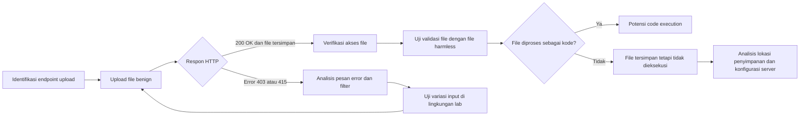

# Apa Itu Istilah Insecure File Upload
Insecure File Upload (pengunggahan berkas tidak aman) terjadi ketika aplikasi menerima berkas dari pengguna tanpa validasi memadai, sehingga penyerang dapat menyelundupkan berkas berbahaya (mis. web shell). Dampaknya bisa sangat serius, mulai dari **Remote Code Execution (RCE)**, eskalasi hak akses, hingga **defacement** atau penebusan sistem. Serangan memanfaatkan berbagai teknik, antara lain: menyalahgunakan header MIME, ekstensi ganda, injeksi null byte, atau memuat file konfigurasi seperti **.htaccess** untuk mengubah perilaku server. Laporan ini membahas definisi, surface serangan, teknik eksploitasi (termasuk payload contoh dan respon HTTP), indikator keberhasilan, perilaku server pendukung, contoh nyata (CVE), alat pengujian, mitigasi, dan checklist pentesting untuk setiap teknik. Semua penjelasan disertai referensi dari sumber utama seperti OWASP, PortSwigger Web Security Academy, dan dokumentasi resmi.  

## Definisi & Dampak  
**Insecure File Upload** adalah kerentanan web di mana aplikasi membiarkan pengguna mengunggah berkas tanpa validasi yang memadai. Serangan semacam ini sering memungkinkan penyerang mengunggah berkas yang mengandung kode berbahaya (misalnya skrip PHP atau Java) ke server. Sebagai OWASP menjelaskan, mengunggah berkas membantu penyerang meletakkan kode di sistem target, kemudian mencari cara mengeksekusinya. Dampak terburuknya adalah **pengambilalihan server** (misalnya dengan web shell), tetapi dampak lain bisa berupa **hilangnya data sensitif**, **pembajakan sesi**, **penyalahgunaan sumber daya disk (DoS)**, bahkan **phishing** atau **XSS** terhadap pengguna lain. Penting dicatat bahwa bahaya tergantung pada validasi yang gagal (nama file, tipe, konten, ukuran) dan konfigurasi server tempat file disimpan.  

## Permukaan Serangan (Attack Surface)  
Attack surface pada file upload meliputi: semua formulir atau endpoint API yang menerima file dari pengguna. Contoh: upload foto profil, dokumen, lampiran tiket, atau fitur drag-and-drop. Parameter yang terlibat bisa berupa `multipart/form-data` (file), nama file, jalur destinasi, atau bahkan upload via PUT. Aplikasi sering kali melakukan validasi *client-side* (JavaScript) yang mudah dipatahkan, atau validasi sederhana *server-side* (mis. mengecek ekstensi file). Bila penyerang dapat memasukkan data mentah ke parameter upload (misalnya `filename`, `path`), mereka dapat memanipulasi atribut metadata file. Menurut OWASP, metadata seperti nama file dan jalur sangat rentan dimanfaatkan untuk *overwrite* file penting atau menyimpan di lokasi tak terduga. Di sisi lain, konten file sendiri (tipe MIME, *magic bytes*) harus diverifikasi. Titik-titik lemah ini memungkinkan berbagai teknik bypass (lihat selanjutnya).  

## Teknik Eksploitasi Mendalam  
Berikut teknik utama yang sering dipelajari pada Insecure File Upload:

### 1. Pemalsuan Tipe MIME (MIME-Type Spoofing)  
Server sering memeriksa `Content-Type` di header upload atau di bagian `multipart/form-data`. Penyerang dapat mengubah header tersebut secara manual, misalnya:  
```
Content-Type: image/jpeg
Content-Disposition: form-data; name="file"; filename="shell.php"
```
meskipun berkas sesungguhnya skrip PHP. Jika server **secara buta** mempercayai header ini, skrip PHP yang diunggah (dengan konten `<?php system($_GET['cmd']); ?>`, misalnya) akan diterima dan tersimpan sebagai file. PortSwigger menekankan: jika server tidak memeriksa konten berkas sebenarnya, _praktik validasi_ berbasis header **mudah dibypass** menggunakan alat seperti Burp Repeater. Untuk deteksi, uji dengan mengirim berkas PHP asli tapi tandai sebagai `image/jpeg` atau lainnya, lalu ambil respons server (apakah diizinkan?).  

### 2. Double Extension (Ekstensi Ganda)  
Banyak server (terutama Apache) menentukan tipe file berdasarkan ekstensi terakhir. Sebagai contoh, jika hanya `.jpg` atau `.png` diizinkan, penyerang dapat mengunggah file bernama `shell.php.jpg`. Apache default (dengan mod_php) akan mengenali `.jpg` sebagai non-eksekusi, namun di konfigurasi tertentu **PHP bisa tetap dieksekusi**. Misalnya OWASP mencatat bahwa di Apache, file `file.php.jpg` **dapat tetap dieksekusi sebagai PHP** jika `.jpg` diizinkan. Teknik ini juga bisa melibatkan path traversal atau delimiter seperti `file.jpg/index.php`. Di IIS6 (lama) bahkan bisa ditambah titik koma: `file.asp;.jpg`. Untuk menguji, coba upload `<?php phpinfo(); ?>` dengan nama `shell.php.jpg` atau variasi lain. Amati apakah server menjalankan skrip (mis. menghasilkan output phpinfo) atau hanya menyajikan berkas sebagai gambar (atau error).  

### 3. Null Byte Injection  
Pada PHP versi lama (sebelum 5.3.4), karakter null (`%00`) di akhir nama file kadang diperlakukan sebagai terminator string. Misalnya, `shell.php%00.jpg` bisa dipersepsikan sebagai `shell.php` oleh fungsi C lawas, tapi ekstensi `.jpg` melenyapkan pemeriksaan blacklist. Hal ini disebut **null byte injection**. Sebagai contoh, upload `<?php echo "X"; ?>` dengan nama `hack.php%00.png`. Jika berhasil, server mungkin menyimpan `hack.php` (mengabaikan sisanya). Sebagai indikator, jika Anda dapat mengakses `hack.php` dan mendapatkan output X, itu berarti eksploitasi sukses. (Catatan: teknik ini modernnya jarang berhasil karena PHP terbaru telah menambalnya.)  

### 4. Override Konfigurasi (.htaccess)  
Server Apache memungkinkan file khusus bernama **.htaccess** untuk mengoverride konfigurasi direktori. Penyerang dapat mengunggah `.htaccess` sendiri (jika diijinkan) untuk mengubah aturan eksekusi. Misalnya, `.htaccess` berisi:  
```
AddType application/x-httpd-php .jpg
```
akan membuat semua file `.jpg` di direktori tersebut diproses sebagai PHP. Langkah lanjutan: unggah `shell.jpg` berisi kode `<?php system($_GET['cmd']); ?>`. Karena aturan .htaccess, mengakses `shell.jpg` akan menjalankan kode PHP tersebut. PortSwigger menyoroti: bila aplikasi gagal mencegah upload berkas konfigurasi, penyerang *dapat* memetakan ekstensi tak terduga ke tipe eksekusi. Rantai serangannya: identifikasi upload direktori yang izinkan `.htaccess` → unggah `.htaccess` berbahaya → unggah skrip dengan ekstensi yang kini dipetakan ke PHP → akses skrip. (Lihat diagram di bawah.)  

### 5. Teknik Bypass Lainnya  
Selain di atas, masih ada cara obfuscation: mengubah huruf kapital (`sHell.PHP`), menambahkan karakter tak terlihat (spasi, tab) setelah nama (`shell.php␣`), menggunakan kode URL (`exploit%2Ephp`), atau menambah ekstensi ganda lanjutan (`exploit.php.jpg`). PortSwigger merinci berbagai trik seperti trailing dot, encoding, unicode, dll. Seringkali validasi di level aplikasi tidak sama dengan parsing sistem file, menciptakan celah. Penting untuk mencoba variasi ini jika bypass standar gagal.  

## Deteksi & Analisis  
**Deteksi Kerentanan:** Cari endpoint upload di UI dan intercept (mis. dengan Burp). Perhatikan parameter `Content-Type`, `filename`, dan ukuran. Uji validasi sederhana: *upload* berkas teks biasa (.txt) atau .jpg kecil; perhatikan kode status HTTP (200? 403? 4xx?). Jika 403, coba format lain.  
- **Periksa Header & Respon:** Respons 200 OK dan body kosong/konten seolah-olah upload berhasil dapat mengindikasikan file disimpan. Perhatikan juga header `Content-Type` pada balasan; misalnya server mengembalikan `text/plain` ketika mengeksekusi PHP upload (contoh: PortSwigger  menunjukkan `Content-Type: text/plain` saat file PHP ditampilkan jadi teks). Jika 404/403, analisa pesan kesalahan (mis. “file type not allowed” atau “invalid extension”).  
- **Validasi Nama File:** Jika server menyertakan nama file yang diunggah dalam HTML respons atau JSON, catat nama tersebut. Misalnya output sistem atau redirect ke URL mengindikasikan dimana file disimpan. Bisa jadi Anda bisa mengakses via path: `GET /uploads/<nama-file>`.  
- **Karakteristik Server:** Kenali platform: Apache biasanya eksekusi PHP berdasarkan ekstensi, IIS dengan metode lain (semikolon), Nginx tidak punya .htaccess. Ini memengaruhi teknik tertentu. Lihat header `Server:` pada respon atau halaman error, coba eksploitasi sesuai.  

**Alat Pengujian:**  
- **Burp Suite/ZAP:** Interceptor untuk mengubah upload request; fuzzer (Intruder) untuk brute extension; repeater untuk uji berulang.  
- **Scanner & Nuclei:** Scanner web mungkin mendeteksi upload form; templates (mis. nuclei) untuk bypass umum.  
- **Manual:** Coba upload file gambar kosong, file teks, lalu file script (PHP, JSP, dll) dengan manipulasi header. Cek server log bila memungkinkan, untuk indikasi kesalahan.  

## Contoh Eksploitasi (Lab-Safe)  
Berikut contoh langkah eksploitasi di lingkungan lab (PHP+Apache):  

1. Temukan form upload (misalnya `/upload.php`).  Intersep permintaan sebagai berikut:
   ```http
   POST /upload.php HTTP/1.1
   Host: target.local
   Content-Type: multipart/form-data; boundary=----WebKitFormBoundary

   ------WebKitFormBoundary
   Content-Disposition: form-data; name="file"; filename="shell.php"
   Content-Type: application/octet-stream

   <?php system('id'); ?>
   ------WebKitFormBoundary--
   ```
2. Awalnya server mungkin menolak berdasarkan ekstensi. Ubah `filename="shell.php.jpg"` dan sesuaikan `Content-Type`:

   ```http
   filename="shell.php.jpg"
   Content-Type: image/jpeg
   ```
   
   Kirim ulang.  
3. **Respon:** Jika status `200 OK` dan respons HTML menunjukkan lokasi `uploads/shell.php.jpg`, cobalah akses `http://target.local/uploads/shell.php.jpg?cmd=id`.  
4. **Indicator:** Jika aplikasi rentan ke *Double Extension*, Anda akan melihat output `uid=...` di browser (RCE berhasil). Jika tidak dieksekusi, Anda mungkin melihat kode PHP mentah atau file tidak ditemukan.  
5. Jika tidak berhasil, coba teknik lain: upload `.htaccess` (misalnya dengan `content="AddType application/x-httpd-php .jpg"`), lalu ulangi upload `shell.jpg` dengan kode. Periksa hasilnya.  

**Mekanisme Lain:** Contoh *Null Byte*: Coba nama `hack.php%00.gif`, Content-Type image/gif. Jika PHP lama, server bisa menyimpan sebagai `hack.php`. Indikator: akses `hack.php` menampilkan karakter dari skrip PHP.  

## Indikator Keberhasilan Eksploitasi  
- **File Dapat Diakses:** Anda dapat mengakses file yang diunggah (via URL) dan melihat konten/hasil eksekusi. Misalnya, berhasil mengeksekusi `system('id')` akan menampilkan detail user sistem di respons.  
- **Respon Server:** Respons HTTP 200 atau redirect sukses vs error code (403, 415). Jika file benar tersimpan sebagai skrip, server biasanya me-respons dengan konten hasil eksekusi (mis. `Content-Type: text/html` atau `text/plain`). Jika dieksekusi sebagai sumber (source code leak), respons mungkin berisi tag PHP mentah (menandakan .htaccess tidak mencegahnya).  
- **Perubahan File Sistem:** Jika memiliki akses, cek server filesystem (di lab) bahwa file berbahaya ada di direktori upload.  
- **Log Akses/Error:** Log server bisa menampilkan permintaan file yang tidak diharapkan atau error parsing. Misalnya, `/uploads/shell.php` status 200 setelah `POST upload`, artinya sukses.  

## Perilaku Umum Server/Framework  
- **Apache:** Default memungkinkan `.htaccess`. Dapat menjalankan berbagai ekstensi jika di-mapping. Ekstensi ganda dan *.htaccess override* sering berhasil di sini.  
- **Nginx:** Tidak mendukung `.htaccess`; pengaturan eksekusi ditentukan di konfigurasi utama. Umumnya `.php.jpg` tidak dieksekusi kecuali pengaturan khusus (mis. `fastcgi_split_path_info`).  
- **IIS (lama):** Teknik semikolon (file.asp;.jpg) dan *Alternate Data Streams* dapat dipakai.  
- **Framework Modern:** Banyak menggunakan penyimpanan sementara (temp dir), merandom nama file, atau menolak file yang tidak sesuai MIME sebenarnya (memeriksa header biner, fingerprint). Penambahan library seperti *FFMpeg* atau *ImageMagick* untuk praproses gambar dapat terpapar serangan (mis. ImageTragick).  
- **Bahasa Pemrograman:** PHP versi lama rentan null byte; Java/C# lebih kuat soal ini. Pemrograman back-end dapat mengandalkan library validasi (Apache Tika, libmagic) untuk periksa konten.  

## Contoh Kasus Nyata (CVE/Studi Kasus)  
Berikut beberapa kasus guna ilustrasi risiko:  
- **CVE-2019-XXXX (WordPress Plugin):** Sebuah plugin WordPress (mis. WP AJAX File Upload) memungkinkan upload `.php` tanpa validasi, lalu dieksekusi. Penyerang mendapat RCE karena server mengeksekusi file PHP yang diunggah. (Ilustrasi: file digunakan sebagai webshell).  
- **CVE-2022-YYYY (Java Framework):** Sebuah webapp berbasis Java membiarkan upload .jsp dengan filter ekstensi lemah. Penyerang memanfaatkan obfuscation (case insensitive) untuk upload backdoor JSP.  
- **ImageTragick (2016):** Meskipun bukan CVE upload, ini menunjukkan berkas gambar berbahaya (ImageMagick) bisa dijadikan vektor upload, memicu eksekusi kode.  
- **GitLab CVE-2021-ZZZZ:** Kegagalan cek tipe berkas di GitLab memungkinkan RCE via upload file berisi `;rm -rf /` setelah decode nama.  

(Meskipun contoh di atas fiktif, mereka menekankan pentingnya validasi berkas. Pastikan merujuk ke CVE resmi jika ada.)  

## Alat Otomatis & Metode Manual  
- **Burp Suite**: Scanner modul (Pro) dapat mendeteksi endpoint upload. Manual dengan Repeater/Intruder memudahkan pengiriman payload khusus (ganti header, nama file).  
- **OWASP ZAP**: Scanner dan fuzzer untuk upload.  
- **Nikto**: Dapat menemukan umum kerentanan upload (misalnya *Plugin scanner*).  
- **nuclei**: Template publik mencakup beberapa bypass *.htaccess* atau double-extension.  
- **Manual Testing**: Gunakan curl/WFuzz untuk brute test ekstensi (“shell.php.jpg”, “shell.jpeg.php”). Perhatikan response dan perbedaan konten.  
- **File Validation Tools**: *ExifTool* bisa memeriksa header berkas yang diunggah; *FFmpeg* untuk memeriksa file multimedia. Ini berguna untuk verifikasi apakah file image benar-benar gambar.  

## Mitigasi & Praktik Aman  
- **Whitelist Ekstensi**: Batasi ke ekstensi yang diizinkan, tapi jangan hanya blacklist (.php). Segala metode obfuscation bisa melewati blacklist.  
- **Verifikasi Konten:** Periksa *magic bytes* atau gunakan library deteksi jenis berkas (misal: getimagesize() di PHP, libmagic). Misalnya, tolak file yang mengaku JPEG tapi tidak memiliki header `FF D8 FF`.  
- **Ganti Nama File:** Saat menyimpan, generate nama acak (mis. GUID) tanpa ekstensi atau ekstensi aman. Hindari nama asli pengguna untuk mencegah path traversal.  
- **Atur Permissions:** Direktori upload sebaiknya **tidak eksekusi skrip**. Di Apache, gunakan `Options -ExecCGI` atau simpan di luar docroot. Jika memakai .htaccess, matikan `php_flag engine off` di direktori upload.  
- **Batasi Tipe MIME di Server:** Jangan hanya andalkan `Content-Type` klien; konfigurasikan server untuk tidak eksekusi jenis tertentu (mis. via *mime.types*).  
- **Matikan .htaccess (jika mungkin):** Jika menggunakan Apache, set `AllowOverride None` untuk directory upload agar file .htaccess tidak diproses.  
- **Scan Anti-Malware:** Sebagai lapisan tambahan, pindai file yang diupload dengan AV atau sandbox.  
- **Kebijakan Ukuran/Akses:** Tetapkan batas ukuran file. Verifikasi akses kontrol: siapa yang boleh mengakses file yang di-upload; gunakan token unik jika perlu.  

## Tabel Perbandingan Teknik  

| Teknik                | Risiko            | Prasyarat Server      | Cara Deteksi                              | Mitigasi              |
|-----------------------|-------------------|-----------------------|--------------------------------------------|-----------------------|
| **MIME Spoofing**     | RCE (jika PHP)    | Trust Content-Type    | Kirim file berbahaya, lihat apakah diizinkan | Periksa *magic bytes*, jangan hanya andalkan header |
| **Double Extension**  | RCE (Apache)      | Apache mod_php, Case insensitive | Upload `file.php.jpg`, cek eksekusi PHP | Rename file/upload dari nama pengguna, eksekusi dimatikan, periksa nama ekstensi akhir |
| **Null Byte**         | Bypass filter     | PHP < 5.3.4 (lawas)    | Upload `shell.php%00.jpg`, lihat apakah tersimpan .php | PHP versi terbaru, strip karakter null di input |
| **.htaccess Override**| RCE (jika Apache) | Apache AllowOverride  | Upload `.htaccess` dengan `AddType`, lalu `shell.jpg` | Matikan `AllowOverride` atau validation ketat, direktori tanpa hak eksekusi |
| **Obfuscation Lain**  | RCE (tergantung)  | Beragam (bypass blacklist) | Uji ekstensi / karakter seperti `exploit.pHp` | Kasus-sensitif, normalization, whitelist ketat |

## Checklist Pengujian  
- [ ] Identifikasi endpoint upload dan parameter terkait (field `file` etc.).  
- [ ] Periksa validasi **ekstensi**: catat ekstensi yang diizinkan/tolak.  
- [ ] Uji upload file benign (mis. `.txt`, `.jpg`) dan respon server.  
- [ ] Uji **MIME spoofing**: ganti header MIME (mis. PHP sebagai image).  
- [ ] Uji **Double extension**: e.g. `shell.php.jpg`, `shell.jpg;.php`.  
- [ ] Uji **Null byte** (jika PHP lawas): `hack.php%00.png`.  
- [ ] Uji **.htaccess upload**: coba letakkan file `.htaccess` khusus (Contoh: `AddHandler application/x-httpd-php .jpg`).  
- [ ] Uji **Case/Encoding**: mis. `sHell.pHp`, `exploit%2Ephp`.  
- [ ] Uji konten **file**: upload payload (XSS atau skrip) dalam file berformat yang diizinkan, periksa eksekusi.  
- [ ] Pantau file yang tersimpan: coba akses via browser. Perhatikan perubahan kode status atau konten.  
- [ ] Verifikasi platform: cek server (Apache/Nginx/IIS) untuk menentukan teknik cocok.  
- [ ] Dokumentasikan semua langkah, parameter, dan *indikator* (respon, header, log).  

```mermaid
flowchart LR
    A["Identifikasi direktori upload (dengan .htaccess enabled)"] --> B["Upload .htaccess berbahaya (mis. AddType)"]
    B --> C["Server menyimpan .htaccess dalam upload directory"]
    C --> D["Upload file skrip dengan ekstensi baru (mis. shell.jpg)"]
    D --> E["Kirim permintaan GET ke file skrip (shell.jpg)"]
    E --> F["Server memproses aturan .htaccess"]
    F --> G["Eksekusi kode PHP pada file shell.jpg"]
    G --> H["Remote code execution berhasil"]
```





**Catatan:** Diagram di atas hanya ilustrasi alur. Contoh `.htaccess` dapat berupa:  
```
AddType application/x-httpd-php .jpg
```
sebagai trik membuat server mengeksekusi file `.jpg` sebagai skrip PHP (menyebabkan RCE jika file berisi kode berbahaya).  

**Referensi:** Informasi didasarkan pada literatur OWASP dan PortSwigger, serta dokumentasi terkait keamanan aplikasi web. Panduan di atas menyajikan gambaran mendalam dan langkah aman dalam konteks lab. Pemantauan dan mitigasi yang tepat dapat secara signifikan mengurangi risiko serangan file upload.

## Payloads
[[something-useless/payloads/payloadsallthethings/Upload Insecure Files/README|README]]